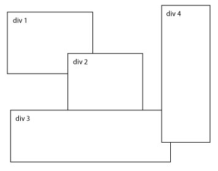
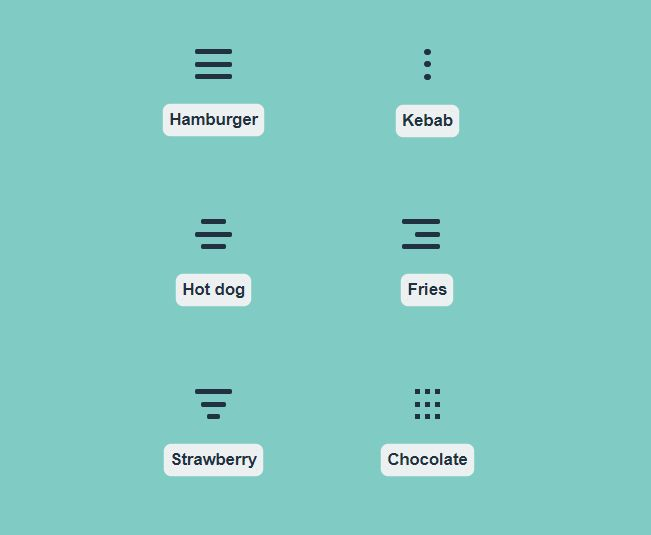

# Ejercicios de repaso de CSS

## Ejercicio 1: Chaotic layout
Usa la propiedad `position` para desarrollar el siguiente layout:  

  

## Ejercicio 2: Cool button
Diseña un botón que, cuando se le haga `hover` con el ratón, tenga un efecto chulo. Puede ser como tú quieras: da rienda suelta a tu imaginación. Investiga en las posibilidades de la propiedad `transform`.

Puedes inspirarte en [este diseño](https://startling-cannoli-cabca2.netlify.app).  

## Ejercicio 3: Hamburger buttons
Usa tus conocimientos de CSS para diseñar, al menos, tres **hamburger buttons** de estos ejemplos:  

### Bonus track  
Ahora, dale algún tipo de efecto a los botones cuando se haga `hover` sobre ellos. Cada botón tiene que tener un efecto **diferente**, y **AL MENOS UNO** de los botones debe tener un efecto de posición. Por ejemplo: si has hecho el botón "Kebab", cuando hagas `hover` los puntitos deberán pasar de estar en columna a estar en fila. O, si has hecho el "Hamburger", las tres líneas deben convertirse en un aspa.

## Ejercicio 4: Responsive header

Crea un header responsive que tenga al menos dos vistas, una de escritorio y otra móvil:  

### Requisitos:
1. El header debe hacerse con **flexbox**. Queda terminantemente prohibido usar margen o padding para centrar los elementos.
2. En la vista desktop, el header debe quedar fijado al límite superior de la pantalla cuando se haga scroll.
3. El breakpoint para la vista mobile sera de `768px`. 
4. Además de los cambios de posición, en la vista mobile debe aparecer un menú hamburger (estará escondido en la vista desktop). 
5. Tanto el header como el hamburger de la vista mobile deberán permanecer en su posición cuando se haga scroll.
6. Los links del header deben tener algún tipo de efecto cuando se pase el ratón sobre ellos.  

## Ejercicio 5: CSS Grid: the Flexbox nemesis
Usando CSS Grid, crea estas 3 layouts y usa **media queries** para hacer que transicionen de una a otra. Debes usar en **al menos una layout** la propiedad `grid-template-areas`, pero no puedes usarla en todas: en **al menos una layout** debes buscar otra forma de hacerlo con Grid.

## Mini-proyectos

### 1. Card collector
Diseña y desarrolla una card de producto que tenga una imágen de fondo, un título, texto explicativo (pueden ser todo Lorem Ipsum, por supuesto) y un botón. A continuación, dale efectos y animaciones para hacerla interactiva cuando el usuario pase el ratón sobre ella. Cuanto más loco el efecto, mejor. Buscamos barroquismo, rococó.

Puedes inspirarte en **[este diseño](https://amazing-cranachan-4ae763.netlify.app)**.

### 2. Pricing Panel
Clona **[este repositorio](https://github.com/DaniPhilo/pricing_panel_starter)** en tu ordenador. En él encontrarás un HTML ya escrito y preparado, y un archivo CSS para que lo rellenes; también tienes una carpeta con las imágenes que necesitarás. El objetivo es desarrollar un panel exacto a **[este](https://strong-buttercream-9cddf8.netlify.app)**. 
**Aviso**: ¡es responsive! Eso también deberás programarlo.

### 3. Responsive paralax website
Echa un vistazo a esta web([Encore](https://altcampus.github.io/encore/#)) y trata de copiar su diseño.

A priori, es un landing bastante sencillo. Sin embargo, deberías tener en cuenta dos cosas:
1. La web es responsive: deberás copiar eso también, en los mismos breakpoints y tratando de que el resultado sea el mismo.
2. Cuando entres en la web, haz scroll y fíjate en la imágen de fodo: ¿ves cómo se queda fija mientras la página desciende? Ese efecto se llama **Parallax effect*, y usado con gusto puede dar lugar a diseños verdaderamente interesantes, cómo por ejemplo [éste](http://porschevolution.com/#1920s).

**Happy coding!!**
