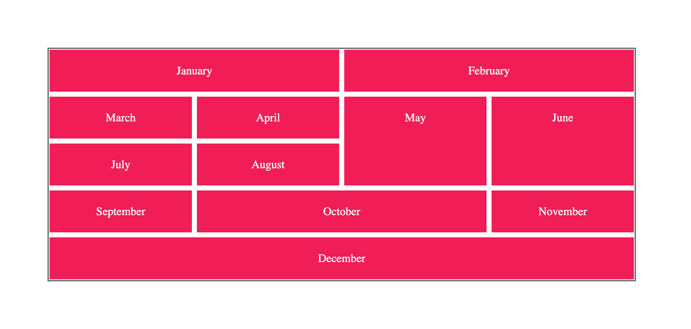

# CSS Grid Example

## Introducción
CSS Grid es una herramienta similar a Flexbox: sirve para ordenar diversos elementos en nuestra página. Grid organiza el contenedor al que se le aplica de un modo similar a una tabla: en filas y columnas.

Para realizar este ejercicio, te proporcionaremos un archivo `HTML` y `CSS` con el código inicial. Cópialos o clona el repositorio para usarlos.

HTML:
```html
    <section class="grid-container">
        <div id="january">January</div>
        <div id="february">February</div>
        <div id="march">March</div>
        <div id="april">April</div>
        <div id="may">May</div>
        <div id="june">June</div>
        <div id="july">July</div>
        <div id="august">August</div>
        <div id="september">September</div>
        <div id="october">October</div>
        <div id="november">November</div>
        <div id="december">December</div>
    </section>
```

CSS:
```css
* {
    margin: 0;
    padding: 0;
    box-sizing: border-box;
}

body {
    display: flex;
    justify-content: center;
    align-items: center;
    min-width: 100vw;
    min-height: 100vh;
}

.grid-container {
    border: 2px solid grey;
}

div {
    padding: 20px 0;
    background-color: #E91E62;
    color: white;
    border: 1px solid white;
    text-align: center;
}
```

## Contenedor grid

### Declarar un contenedor como `grid``
```css
.grid-container {
    display: grid;
}
```

### Declarar columnas
```css
.grid-container {
    display: grid;
    grid-template-columns: 300px 300px 300px;
}
```


```css
.grid-container {
    display: grid;
    grid-template-columns: 300px 300px 300px 300px;
}
```


#### Repetir columnas
```css
.grid-container {
    display: grid;
    grid-template-columns: repeat(3, 300px);
}
```


### Declarar filas
```css
.grid-container {
    display: grid;
    grid-template-columns: repeat(3, 300px);
    grid-template-rows: 100px 200px 100px;
}
```


### Espacio entre filas / columnas
```css
.grid-container {
    display: grid;
    grid-template-columns: repeat(3, 300px);
    column-gap: 20px;
    row-gap: 5px;
}
```


## Posicionar elementos dentro del contenedor grid
Las columnas y filas empiezan en el borde de la tabla con índice 1:


### Ocupar más de una columna / fila
```css
#january {
    grid-column-start: 1;
    grid-column-end: 4;
}
```


```css
#january {
    grid-column-start: 1;
    grid-column-end: 3;
    grid-row-start: 1;
    grid-row-end: 3;
}
```


Puede abreviarse del siguiente modo:
```css
#april {
    grid-column: 1 / 3;
    grid-row: 2 / 4;
}
```


## Ejercicio
Usando lo que has parendido de `CSS Grid`, y con el `HTML` y `CSS` que te hemos proporcionado, intenta conseguir el siguiente layout:  

